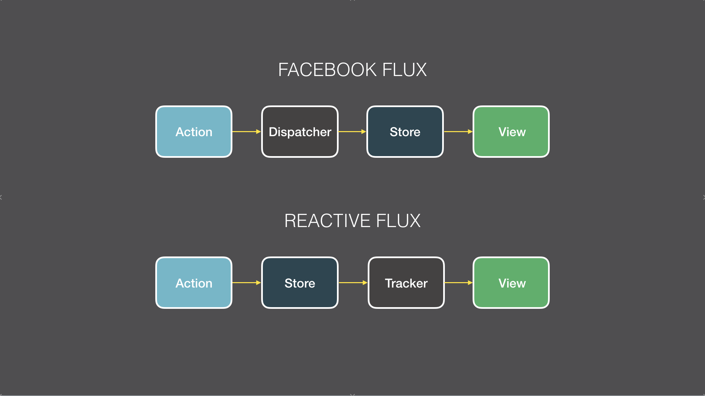

# Reactive Flux Pattern for Meteor



### API

After installing `reactive-flux-store` you can:

1) Create a `Store`.

```
MyStore = new Store('MyStore');
```

2) Create callable methods ("actions").

```
MyStore.methods({
  'SOMETHING_HAPPENED': function() {
    // can access this.state and call this.setState()
    this.setState({didSomethingHappen: true});
  }
});
```

3) Access the Store

```
// Inside of a React Component
getMeteorData() {
  return {
    didSomethingHappen: MyStore.get('didSomethingHappen')
  }  
}
```

4) Call the methods ("actions"):

```
// Inside of a React Component
handleEvent() {
  MyStore.call('SOMETHING_HAPPENED');  
}
```

5) Create declaritive NAMED queries:

```
MyStore.dataSources({
  'RECENT_UNSEEN_NOTIFICATIONS': function() {
    return Collection.find({/* some crazy query */}).fetch();
  }
});

// Accessed the same way as "state"
MyStore.get('RECENT_UNSEEN_NOTIFICATIONS');
```

**TODO:**
- Is there a way to validate that all return values of functions passed to `Store.dataSources` are reactive?
- What style pattern should we follow for "naming" actions or data sources? (UPPERCASE_UNDERSCORE, camelCase, etc)

...

# Thoughts on Flux

### Outline
1. What is Flux?
2. Key Concepts in Flux
3. Parts of a Flux application
4. Key Takeaways
5. Using Flux with Meteor
6. Resources


TL;DR: React + Meteor = Use a Flux Pattern

### What is Flux?

TL;DR: Flux is just a pattern.

Flux is a client side application architecture used at Facebook.  Its purpose is to help a team of developers organize code and have more predictable and understandable application state and data management.

**Vocabulary:**
- **Actions:** Named "events" with new "data" sent to the "Dispatcher".
- **Dispatcher:** Informs "Stores" of "Actions".
- **Stores:** Has all "state" and "data" related to it's own "domain".
- **Views:** Receives "state" and "data" from "Stores" and triggers "Actions".


### Key Concepts in Flux

TL;DR: Data flows in one direction.

- Unidirectional flow of data helps the application remain easy to understand and debug while the code base grows.
- Having a "single source of truth" removes complexity when changes occur.
- Decoupling the data and state from the Views creates better separation of concerns.
- The mental model of the programmer is just as important as the code itself.
- Parts of the application should be highly decoupled and "know" as little about the other parts as possible.
- All control should reside in the Stores. Stores are not acted upon, but rather informed by actions.

### Parts of a Flux Application

1. Actions

2. Dispatcher

3. Stores

In Flux, the Store contains all of the state and logic related to the "domain" they own.

4. Views

Views are composed of (React) Components. Typically, split up into two flavors:

a) "Controller" or "Container" Component. Their responsibility is to retrieve state and data from Stores and pass that along to it's child components as props.
b) "Pure" or "Dumb" Components receive all data and state of the application via props and can trigger Actions via events.

### Key Takeaways

- Flux is just a pattern.
- One directional flow of data is good.
- Separate data and state from Views.
- Have "single sources of truth".
- Decompose "problem" into smaller, well-define functions.

### Using Flux Patterns with Meteor

One of (if not the) best parts of Meteor is the reactivity across client and server. The underlying technologies/packages/libraries can provide incredible power and simplicity to applications when utilized correctly. Unfortunately, these tools have not come with a great pattern or "architecture" to follow. This has made it a guessing game for knowing where your code should go and how your code base can sustainably grow.

An early pattern that emerged in Meteor was managing all "data" via Minimongo, Meteor Methods, and pub/sub, while managing all "state" via Session variables.

While the data management worked wonderfully, Session variable-based "state" management quickly turned into a mess, mainly for the following reason:

- Control over mutating a given Session variable was often sprinkled throughout the code base making it hard to see where, when, and how this "state" change effected the rest of the system.

This problem was often described (or complained about) as Session variables "bouncing" all around wreaking havoc across the application as they were mutated.

I believe this issue is with the architecture (or pattern), not with the underlying technology.

Here's my current thinking on how to implement the Flux pattern / architecture inside of Meteor when using React as the view layer:

**Stores:**
- Always return reactive data sources.
- Reactive "state" is maintained using the ReactiveDict package.
- Hold the only and exclusive "Action" methods that can change reactive "state".
- Reactive "data" is maintained using Minimongo Collections.
- Reactive "data" is manipulated via Meteor Methods through "Action" methods.
- Reactive "data" is NAMED and access via Stores.
- Container/Controller Components access all "data" and "state" from Stores, but to the components "data" and "state" are the same thing: a reactive data source.
- Application "state" should not mirror "data". Always have "single source of truth".

**Actions:**
- Inform the Stores about user events.
- Are called by Components.
- Actions must be **declarative** and not imperative. For example, use `SOMETHING_HAPPENED` or `USER_DID_SOMETHING` and not `SET_THAT_VARIABLE_TO_FALSE`.
- Contain all the logic regarding mutating "state" or "data"
- Sits in between Components and Minimongo, calls Meteor.methods.


### Resources

- [Facebook Flux Overview](http://facebook.github.io/flux/docs/overview.html#content)
- [Flux For Stupid People](http://blog.andrewray.me/flux-for-stupid-people/)
- [Meteor Manual](http://manual.meteor.com/#deps-overview)
- [Meteor Data Mixin](http://react-in-meteor.readthedocs.org/en/latest/meteor-data/)
- [Facebook Flux Why We Need a Dispatcher](http://facebook.github.io/flux/docs/actions-and-the-dispatcher.html#why-we-need-a-dispatcher)
- [Is there really any need for Flux in Meteor?](https://forums.meteor.com/t/is-there-really-any-need-to-use-flux-in-meteor/12957/5) 
- [Flux inspired architecture for Blaze](https://forums.meteor.com/t/flux-inspired-architecture-for-blaze-would-like-your-design-opinions/6651)
- [Meteor Hackpad: Facebook Flux](https://meteor.hackpad.com/Facebook-Flux-dlEVbs3IceZ)
- [Good answer about Flux in SO Question](http://stackoverflow.com/questions/27264487/from-angularjs-to-flux-the-react-way?answertab=votes#tab-top)
- [Meteor Flux Flow](https://forums.meteor.com/t/meteorflux-flow/920)
- [meteorflux:dispacker package](https://atmospherejs.com/meteorflux/dispatcher)

